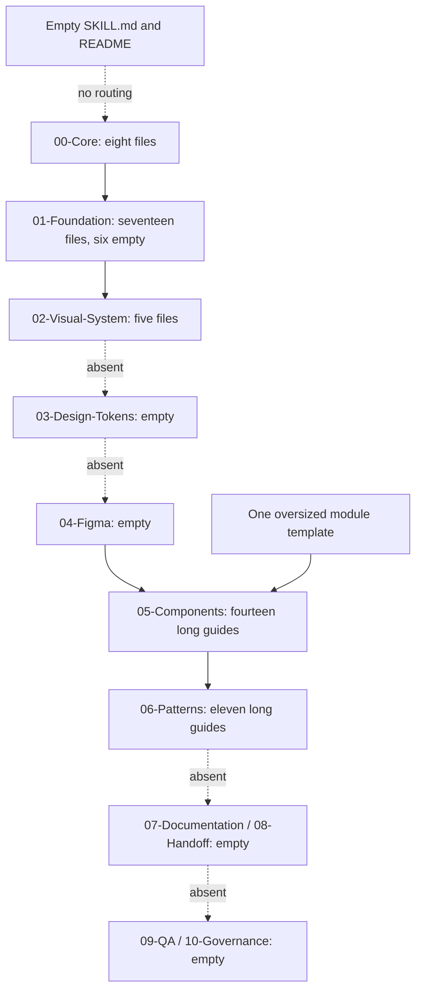
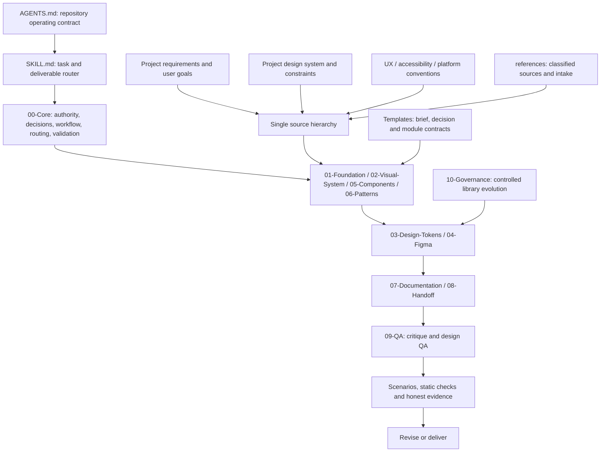

# Design intelligence architecture audit

Date: 2026-10-08. Scope: the entire repository, including empty directories and all 61 files. The first pass was read-only. Repeated identical lines were displayed once where practical; unique instructions and each file's scope were inspected. Baseline source is commit `7896494` plus the three existing uncommitted files recorded in [audit-baseline.json](audit-baseline.json).

## Original architecture

The 61 files total 762,761 bytes. Eleven are empty. There are no executable scripts, tests, CI files, package manifests, runtime configurations, or AGENTS.md files. YAML-like document metadata declares 322 dependency edges; 53 target nonexistent paths. `Assets` is empty. The license is MIT and is retained.

## Findings and structural decisions

| Finding | Consequence | Decision and purpose |
| --- | --- | --- |
| Empty skill entrypoint | No discoverable capability or retrieval route | Populate one SKILL.md; specialize through supporting modules, not competing skills |
| Identity, philosophy, principles each claim overriding authority; four priority orders disagree | Session-dependent decisions | One source hierarchy in AI Operating Rules; role, reasoning, workflow, and critique have distinct owners |
| Every task requires research, three alternatives, ten stages, stakeholder approval and full library governance | Small edits stall or expand scope | Scale work to risk and deliverable; separate exploration, production, and publishing |
| Accessibility and content files are empty despite universal dependency | Quality claims lack testable evidence | Fill authoritative modules; distinguish Figma inspection from runtime accessibility validation |
| Missing Layout Systems, Responsive Design, User Flows, Data Display, Search targets; wrong 03-Components path | Retrieval fails | Keep existing names; add small compatibility routes where preserved files still call old paths; repair other callers |
| Foundations repeat research, journeys, metrics, cognitive rules and governance | Context waste and multiple owners | Assign research, product framing, journey, IA, interaction, visual and systems responsibilities separately |
| Components contain lifecycle, token, motion, QA and governance boilerplate in every file | Specialist instructions are buried | Component Principles owns contracts; shared modules own accessibility, tokens, motion, handoff and governance |
| Buttons, charts, media, calendars and selection controls are forced into universal variant families | Incompatible APIs and combinatorial variants | Group by shared anatomy and behavior; compose unrelated interaction models |
| Navigation documents and onboarding documents substantially overlap | Two competing definitions | Consolidate each into a canonical guide with an explicit compatibility route |
| Authentication pair shares access workflows but account lifecycle is broader | Similarity could lead to harmful deletion | Keep authentication and account-lifecycle scopes distinct |
| Search pair includes broader discovery and existing user additions | Merge could discard user work | Canonical search behavior plus preserved supplemental discovery guidance |
| Fixed 8-point grids, generic desktop sidebars/mobile sheets, one dominant focal point everywhere | Different products converge visually | Content-driven breakpoints, task-driven density and composition; permit simultaneous priorities in expert workspaces |
| Mandatory empty-state art, skeletons everywhere, icon and font defaults by product stereotype | Decorative or predictable output | Use context-specific selection and failure rules, not style prescriptions |
| Token and Figma folders are empty; all values are demanded as variables | Unrealistic tool assumptions | Define primitives/semantics/components, aliases/modes/styles, component properties, capability checks and readback |
| Citation artifacts and empty references headings | Unsupported standards and fake traceability | Shared classified registry, evidence status, review dates, reference intake and explicit adaptation |
| No critique anchors or scenarios | Attractive screens can pass without usable flows | Evidence-based rubric, hard blockers and contrasting representative scenarios |
| Template requires every topic to document every concern | Reproduces overload | Small purpose/scope/decisions/verification template with links to shared ownership |

No numbered domain is moved solely for tidiness. Existing human-readable filenames are retained because links and external consumers may depend on them. New filenames follow the existing topic convention; scripts and structured data use lowercase hyphenated names.

## Recommended architecture

Retrieval is task-based, not this diagram's full traversal. One shared hierarchy governs all domains. Project evidence and existing system bindings precede external patterns and inspiration. Figma mechanisms are implementation tools, not a reason to impose library work on a feature-only request.

## Instruction review method

The [file audit](File%20Audit.md) records purpose, strengths, risks and disposition for every original file. The [dimension matrix](instruction-audit.json) assesses every original instruction-bearing file across the requested dimensions. Its ratings describe instructions, not observed design outputs. A narrow module may delegate a concern explicitly; it should not repeat all global rules.

Baseline strengths: context awareness, recognition over recall, reuse, real content, alternate states, input preservation, responsive thinking and developer awareness. Baseline weaknesses: absent executable entrypoint, quantitative accessibility rules, design-system engineering, Figma production, reference interpretation, critique calibration and representative evaluation.

## Preservation and dependency policy

The initial user edits are `02-Visual-System/Iconography.md`, `06-Patterns/Data Entry & Form Patterns.md` and `06-Patterns/Search & Discovery Patterns.md`. Their complete bytes are preserved, verified by SHA-256 against the working-tree baseline, not merely against HEAD. Scoped operating instructions explain how to use them under current authority. Compatibility routes keep their dependencies usable. No original file is deleted. Navigation and onboarding duplication is consolidated by delegation, preserving old entry paths.

## Quality assessment

Before: broad conceptual knowledge, structurally incomplete and unreliable to invoke; declarative quality checks lack calibrated evidence. After assessment and validation results are recorded in [Validation Report](Validation%20Report.md). There is no invented numerical improvement or claim of elite output from documentation alone.
